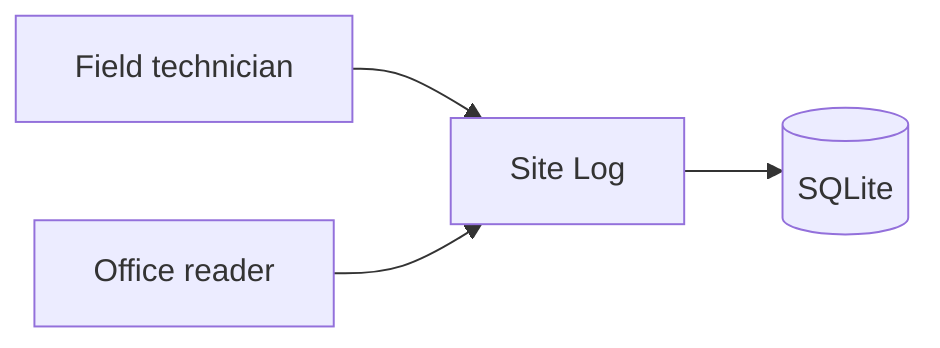
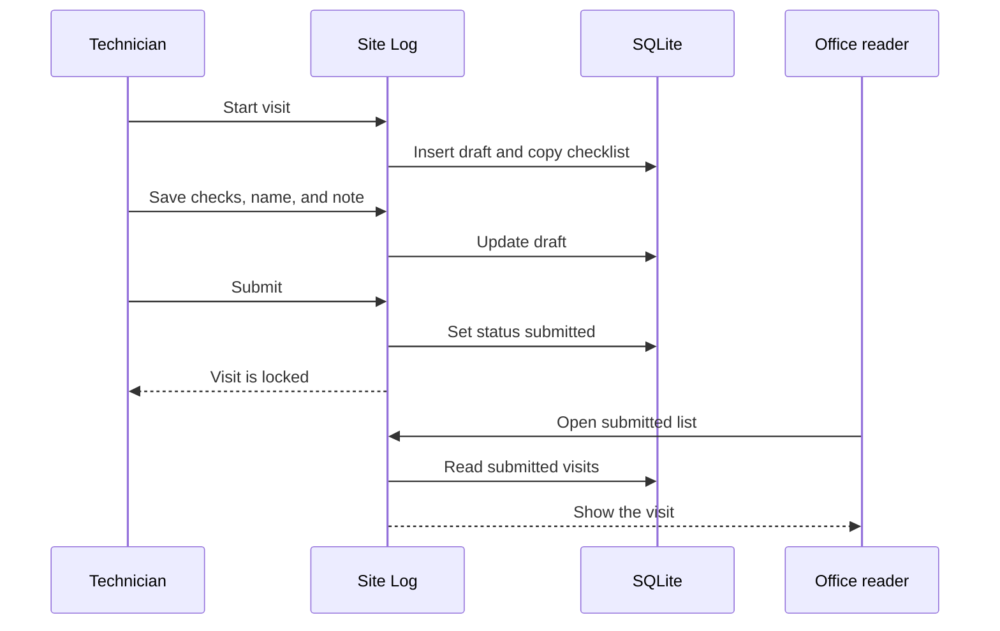

# System design

## Context

The technician and the office reader both use the same web app. There is no second system in the MVP.

## Containers

One Next.js process serves the pages and the server actions. One SQLite file stores sites, checklist items, visits, and checks. The process owns the passphrase check and the session cookie. It does not own file storage, a queue, or a separate identity service. [assumption]

## Critical sequence

J1 ends when the technician submits and the office can read the locked visit.

## Decisions

| Decision | Choice | Why |
| --- | --- | --- |
| Stack | One Next.js app and a SQLite file | Nothing in the request needs a second service. [assumption] |
| Auth | Shared passphrase and an httpOnly session cookie | The team asked for one passphrase and no accounts. [stated] |
| Files | None in the MVP | Photos are FR-007, status later. [stated] |
| State | Server database, not the phone | Offline submit is FR-008, status later. [stated] |

## Not designed yet

FR-007 would add object storage and a file row on the visit. FR-008 would add a local queue and a sync action. Accounts would replace the shared passphrase. Comments would add a second writer on a submitted visit. None of those have tables or routes in this pack.
